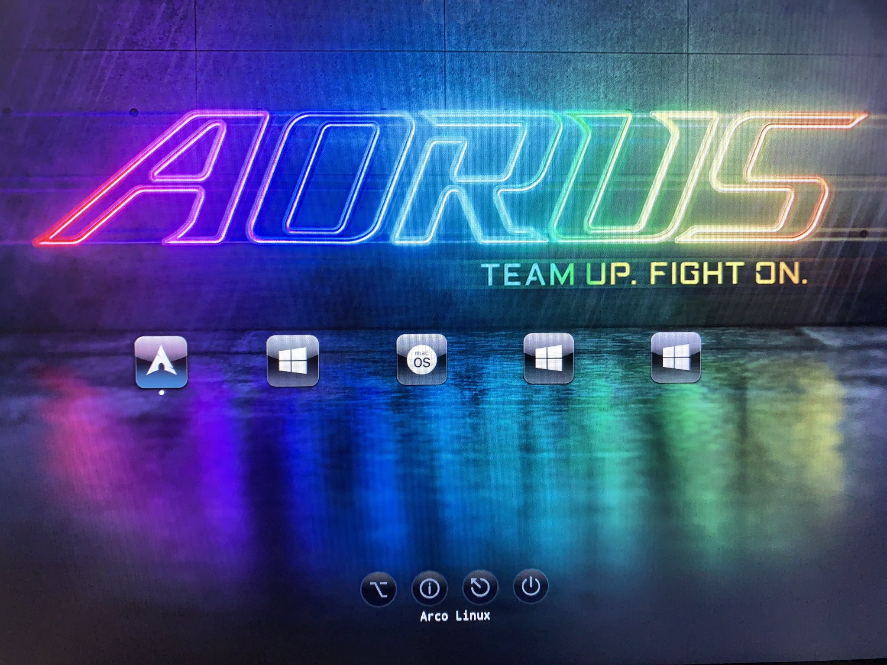

# Clover Configurations

This is just my configuration to run Clover on my machine
Soon to be replace with OpenCore when I manage to set it up :smile:

Specs:
- **Motherboard**: Gigabyte AORUS Z390 Ultra
- **CPU**: i9 9900k
- **RAM**: 16GB 3000Mhz Corsair Vengrance RGB Pro
- **GPU Slot 1**: RTX 2080 (disabled on macOS)
- **GPU Slot 2**: RX 570
- **SSD**: Samsumg 970 EVO 500GB

## My custom theme

